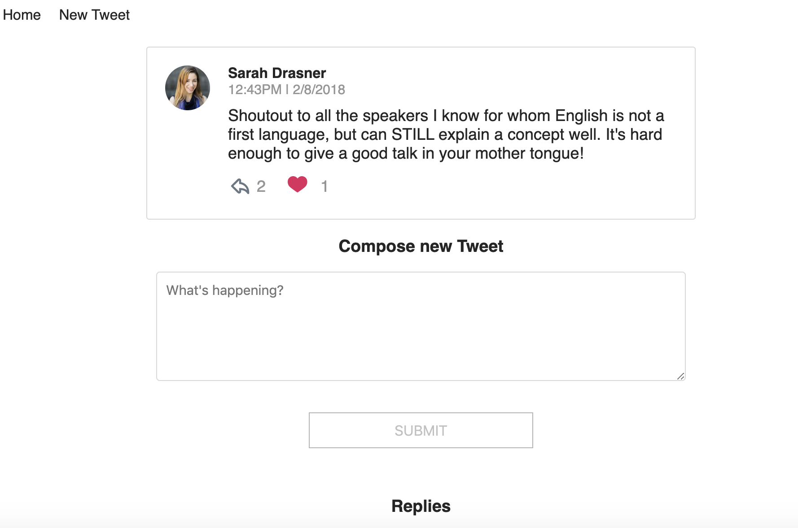

# Chirper Project
A project that mimics twitter, built using React and Redux.

### Dashbroad to show timeline

### Tweet and replies

## Project Setup

* clone the Project - `git@github.com:udacity/reactnd-chirper-app.git`
* install the dependencies - `npm install`

## License

MIT
